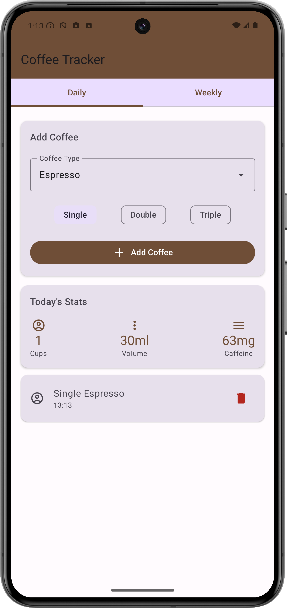
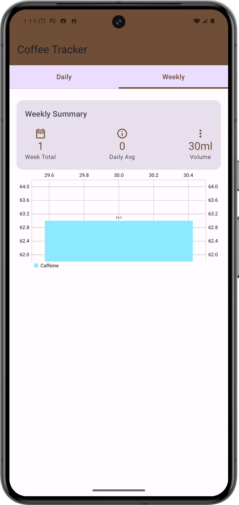
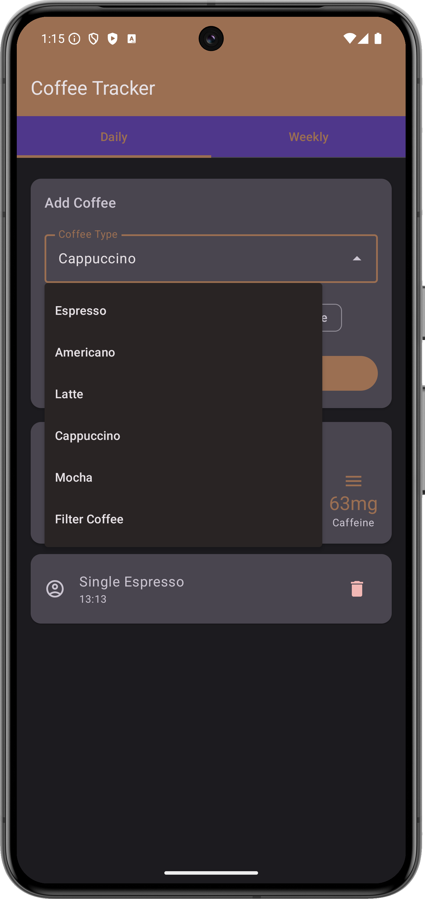

# Coffee tracking app made with Claude (3.5. Sonnet)

## Prompts
1. Make an HTML 5 version of coffee cups tracking application for touch devices.
[Result](https://claude.site/artifacts/42217684-01d6-4129-9a21-73f3f3ba7614)
2. Add different types of coffee and volumes
[Result](https://claude.site/artifacts/3d7525d8-2a3d-4c8f-b0c7-9faaf3847613)
3. Can you implement this for Android?
[Result](https://gist.github.com/phansier/8455ebdca86ed7c8a75c1865d3fff35c)

Commits in this repository divided by steps to make this code runnable.

